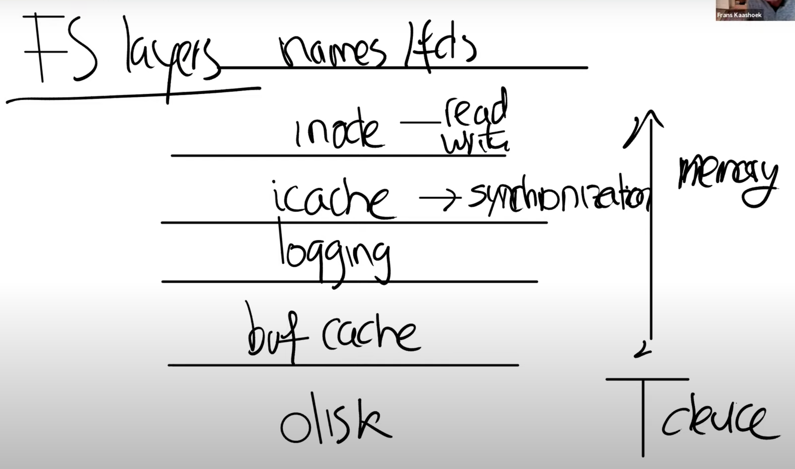

# os|6.s081|file-system

使用一定的数据结构，来索引磁盘上特定位置所保存的数据

## 持久化

- 文件系统为用户的文件提供层级的路径名，便于组织和管理
- 借助文件名，用户和进程方便使用和在程序中操作文件
- 断电保存数据，重启后仍能恢复使用

## 实现

- 使用字符串表示文件具体的路径名，打开文件后，fs会为write函数保存当前写fd的offset
- 使用`link`可以给同一个文件指定不同的名字，fs需要保存这种映射关系
- fd是直接与文件（内部的对象）相对应，而传入字符串只是为了找到该文件，与该字符串（文件名）没有关系

### inode

一个文件在fs中的存在形式，类似于一个`class/struct`，互相之间通过fs内部的一个编号区分；同时，不同的路径名表示同一个inode，通过link count计数

### fd