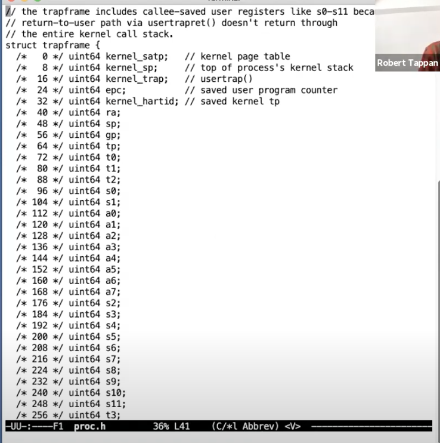

# os|6.s081|isolation

## switch between kernel and user space->trap

- system call
- errors like page fault
- an interrupt from some device makes it necessary to enter into kernel

Key:change the state of hardware

There are 32 register for user including stack register

## important registers

- PC:to save current position of instruction
- Mode:supervisor or user
- SATP:supervisor address translation and protection,pa of page table
- STEVC:supervisor trap vector base address register,the starting position of handle trap in kernel
- SEPC:SUPERVISOR EXCEPTION PROGRAM COUNTER,save the pc of user to return to
- SSRATCH:save the va of trapframle(comes from kernel,fn function save trapfram in a0(the first parameter) and swap it into SSCRATCH)

## process

- save the 32 user register for user to return to
- save pc
- supervisor mode to use previliged instruction
- SATP point to kernel page table
- stack register to point to a kernel stack to call kernel function

## details

- to protect the switch from user code,  we have to promise that the trap hides user
- Supervisor mode:able to write/read controllor register:SATP and so on;user the PTE which contains the PTE_U==0

*still need to access memory by va*

## procedure

### system call

User->ecall->kernel->uservec->usertrap()->sysall()->(int,function address)->sys_func->syscall()->usertrapret()+userret->user

Kernel page table->directly map

user page table->multi level

## two special page in user vm but belong to kernel

- trampoline(execute some instructions to prepare for trap):trap executes in this one which is in user vm(mapped from kernel and **user could not use it**) but in supervisor mode(kernel code)
- only this page in user pt and kernel pt is **the same**
- a middle pate to jump into kernel(user trap)
- From the view of memory, the code section could execute above both

eCall

- user->supervisor
- save user pc in SEPC for returning
- ecall jump to instruction in STVEC

*simple ecall provide more flexibility*

- Trapframe(save some data to enter into kernel):

saving kernel pt address

save 32 user registers in specific position

## usertrap

- in case that switch to another process and lose registers, Proc->trapframe save important registers content 
- p->trapframe ->epc+=4 to skip saved ecall instruction to execute next instruction

## usertrapret

- to let STVEC back to user trap code, we have to close  the interrupt in case that user couldn't execute trampoline
- a user process save its own contents in kernel to use next time

- use fn function to find TRAMPOLINE and trapframe

use SSCRATCH to save syscall result first and swap with a0

## summary

such way to handle trap is important to keep isolated between kernel and user