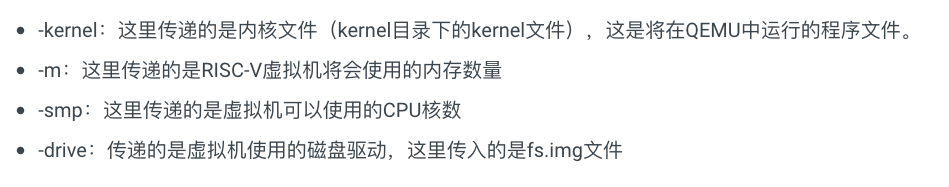

# os|6.s081|organization

## 主题

- isolation，进程间的隔离
- mode->kernel，user，内核和用户态的设计
- syscall：系统调用，用户态程序和内核的交互方式

流程：上述抽象概念的实现方式

## isolation

- 进程之间应该相互隔离，某个进程的错误不应该影响其他进程
- 进程的错误或恶意行为也不应该影响操作系统的运行，操作系统能够正确处理这种错误
- os的一个重要作用：管理进程如何使用硬件资源，协调所有的进程来高效使用资源——cooperative sheduling
  - 如果进程直接使用硬件，可能会阻塞（无限制使用），导致其他进程无法使用
  - 有os后，每个进程可以使用硬件一段时间，之后要换给其他进程使用（上下文切换）
  - 从内存的角度来看，如果直接使用物理内存的绝对地址，那么当有多个进程时，动态的使用内存必须非常小心，否则很有可能侵占其他进程的内存

### 实现

- 应用程序-进程-cpu，cpu是硬件资源，进程表示对cpu的使用。当应用程序运行时，操作系统为这次运行开辟进程，之后该进程可以timely使用cpu的某个核心进行计算（分时复用的操作系统中）
- 进程的内存不是直接使用物理内存，也没有权限；而是有操作系统分配后，使用的虚拟内存（后面详细讲解，此处理解为物理内存的抽象，用于隔离不同进程所使用的物理内存）
- 磁盘的隔离：使用files抽象磁盘块，进程通过files来访问或写入磁盘，同时操作系统通过files来控制进程对该磁盘块的权限

## security

操作系统如果奔溃，就无法为所有程序提供服务；或者被控制，则用户可以拥有对所有硬件和软件的使用权限

- 实现：设置user/kernel mode和虚拟内存

### mode

- 硬件提供的，cpu的两种模式，表示cpu可以执行指令的权限大小；从最基本的运算指令到对硬件控制或读取的指令，或者获取cpu状态
- 特殊的指令必须在内核中执行，否则os将杀死尝试在用户态执行高级指令的进程
- 指令的执行是由cpu进行的，所以区分mode的方式是查看cpu中的某个bit；所谓的在内核中执行，必须先在内核中修改改bit后才能执行kernel mode指令
- 上述流程达到了某种死锁，“想运行特殊指令必须先设置bit，但设置bit的指令也是特殊指令”——解决方式：用户程序需要通过syscall来执行特殊指令，此时会有`ecall`指令来触发kernel中的软中断，查询中断向量表（*根据寄存器状态区分处理方式？*）来进入kernel mode
  - ecall：接受一个序号，表明是哪一个系统调用，接着调入内核的某个特定位置，通过syscall函数找到具体的实现并执行
  - 在具体系统调用的实现中，需要对传入的系统调用参数进行安全性检查

- 宏内核：为保证系统的绝对安全，所有的操作系统操作都在kernel mode中进行
  - 内核中有大量代码，容易出bug
  - 对于硬件抽象的操作（函数）集成在一起，性能好

- 微内核：轻量级的宏内核，在内核中提供简单的utilities和功能，一些重要的操作放在用户态执行
  - 功能和基础设施的耦合性低，需要多次通过内核态传输用户态的运行结果
  - 共享信息困难，性能差，不同的部分隔离

### 虚拟内存

- cpu有当前进程的页表，保存的是进程的虚拟内存与实际使用的物理内存的地址映射关系
- 进程各自的页表是独立的，在分配内存时，操作系统设置页表来保证进程不同进程得到的内存对应到物理内存上是不同的，而进程也只能访问或使用其页表对应到的物理内存
- 从进程的角度看虚拟内存，每个进程的虚拟内存都是一样的，地址从0～$2^n$，但是操作系统会设置页表使得看似相同的虚拟地址映射到不同的物理地址

## Xv6 start

- `kernel`中的所有文件编译成一个程序，运行在kernel mode中

### compile kernel

### qemu

[RISC-V处理器](https://mit-public-courses-cn-translatio.gitbook.io/mit6-s081/lec03-os-organization-and-system-calls/3.8-qemu)

对于每个核，其一直在循环做事：

- 读取固定字节长度的指令
- 解析指令，得到其真正的含义
- 通过软件模拟执行指令
  - 使用一些变量来模拟寄存器的行为

### wakeup

- 为了使用qemu，kernel必须从`0x8000000`进入
- 在单核或者单线程场景下，单个断点就可以停止整个程序的运行
- 胶水代码不实现具体的功能，只是为了适配不同的部分而存在
- `trapframe`,执行`exec(init,...)`初始化shell->第一个用户态进程

## 杂项

- 为了减少cache miss，现代的操作系统会尽力将同一个进程在同一个核上分时复用