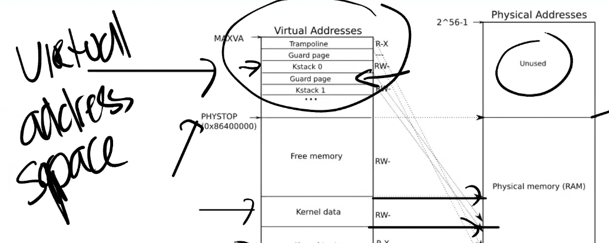

# os|6.s081|page-table

- a kind of map from virtual memory to physical memory

- it plays an important role in isolation among processes

## Address space

what if we directly use physical memory?

a process would usely affect memory that others is using

to protect from each other, we give every process their own adress space including kernel itself.

from the view of every process, it has almost the same range of address.

- Address space:a kind of abstraction from real DRAM, how to implement?
- There is no relation between the max virtual memory address and physical address, the kernel would handle the error if there is no enough DRAM

## implementation

- Hardware:with the help of processors and MMU(memory management unit)
  - MMU:va->pa, and cpu could access real memory
  - how MMU works?CPU tells MMU that where the page tables stores in memory(a register->called SATP(**a pa**) in RISC-V) and MMU could find page table for translation
- every process has its own page table so swithing the content of SATP is necessary
- kernel save the content of SATP of every register
- page table design
  - Base:page(4kb in RISC-V)
    - using every address:2^64->large table
  - page index+offset
  - current RISV-V va:only uses 39 bits=27 bits index+12 bits offset(2&12=4096)
  - Pa:56bit:44bits PPN(physical page number)+12bits offset(**equals to va last 12 bits**)
  - directly map:2^27 occupy a large space

- Multiple levels:27=9*3
- indirect index:an entry in page directory:PTE(page table entry,64bits),stores the pa to the PTE in next level; last level:direcly to the coorsponding physical memory page

### advantage of multi-level page

- page table will cover all vitual page index,so unused virtual pages will take up some space in pt if we use single level index
- In fact, every middle PTE help to find the starting  address in the next level

- like a tree to find actual **PPN**

single level pt have to keep all map while multi-level could only mantain the first level and cow the remain maps

my opinion:SATP(the starting positon of first level PPN)+l2 9bits(a kind of offset)-the starting position in the next level+l1 9bits(offset)

## PTE

44bit PPN+10 bit status

## TLB:translation lookaside buffer

- a complete process to finish map:3 times to access memory->cache

- a cache for virtual address translation
- when process switch occurs->clear TLB(va is the same range in different process)

MMU and TLB resides in  every CPU and cache indexed by va is before MMU while pa is after MMU

## Va->pa

- the index process could be implemented by both sofrware and hardware
- Copy_in/out:kernel translate va from user space into pa to read/write
- the map is completely controlled by os, developer could control memory access using the page fault or pt status

## kernel page table

- boundary in pa->DRAM or I/O devices

- os start from 0x1000
- it is able to write/read IO devices directly
- address of DRAM is one of parts in all 2^56 pa

- kernel stack:use guard page is valid to detect memory stackoverflow by page fault
- every process **has its own kernel stack**

- in the view of kernel, process runs in free memory

## multi-level vs single level

in single level, you have to fill all PTE to fullfill all va mapping while multi-level could only use the first level for this leaving the corresponding low level empty. this way would save more memory.